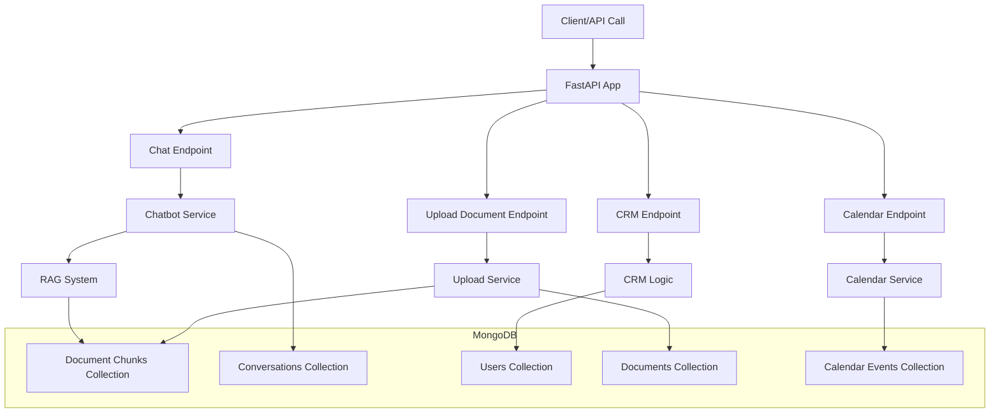

```mermaid
graph TD
    A[Client/API Call] --> B[FastAPI App]
    B --> C1[Chat Endpoint]
    B --> C2[CRM Endpoint]
    B --> C3[Upload Document Endpoint]
    B --> C4[Calendar Endpoint]

    C1 --> D1[Chatbot Service]
    D1 --> E1[RAG System]
    E1 --> F1[Document Chunks Collection]
    D1 --> F2[Conversations Collection]

    C2 --> D2[CRM Logic]
    D2 --> F3[Users Collection]

    C3 --> D3[Upload Service]
    D3 --> F4[Documents Collection]
    D3 --> F1

    C4 --> D4[Calendar Service]
    D4 --> F5[Calendar Events Collection]

    subgraph MongoDB
      F1
      F2
      F3
      F4
      F5
    end
```
